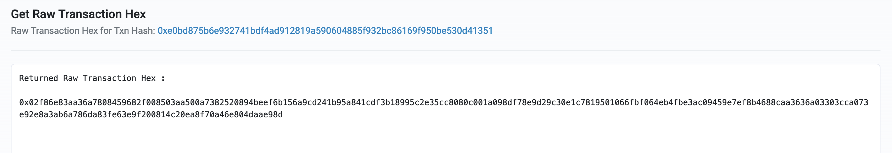

## Solution

This challenge is the only cryptography-related one. Starting with the [Challenge](challenge/project/src/Challenge.sol) contract, we can check the requirements to solve it: in this case, the total supply of the Beef token must be zero (i.e. any and all tokens minted must be burned). Now, by reviewing the [Beef](challenge/project/src/Beef.sol) contract we can easily realize it's a copy of the OpenZeppelin ERC20 implementation, so we can assume that it's a mere distraction.

The deploy script contains the crucial information to begin working:

```solidity
string memory env = "PRIVATE_KEY_";

for (uint256 i = 0; i < 2; i++) {
    uint256 userKey = vm.envUint(string.concat(env, Strings.toString(i)));
    address user = vm.addr(userKey);

    vm.startBroadcast(system);
    beef.mint(address(user), 100);
    payable(user).transfer(1 ether);
    vm.stopBroadcast();

    vm.broadcast(userKey);
    beef.approve(address(beef), 100);
}
```

The script loops over a serie of private keys, minting 100 Beef tokens to them. Interestingly, the script then send an approve transaction with each address. At this point, we know that in order to solve the challenge, we must gain access to the private keys of these addresses (also known as the `user` addresses from now on).

A key aspect is that the challenge infrastructure runs this script with the auto-impersonate mode of [Anvil](https://book.getfoundry.sh/reference/anvil/) enabled, hence the signature parameters of these approve transactions will be not be useful (auto-impersonate mode simply inserts the transactions to the state without doing checks on signatures).

Now, we can check how the addresses look. You can do this with `cast` or by looking for the `Approve` logs:

1. Get the lastest block which should include one of the two approve transactions:

```bash
cast block latest --rpc-url RPC
```

Output: 

```
...
sealFields           []
sha3Uncles           0x1dcc4de8dec75d7aab85b567b6ccd41ad312451b948a7413f0a142fd40d49347
size                 666
stateRoot            0xcf08880d88e15e48d6fcbaed119a6bed7c0c211f0991d0c4464d552a4508ba6b
timestamp            1710744107
withdrawalsRoot      
totalDifficulty      0
transactions:        [0x16d26983b29f58614d56a5fa78b4d8a0d51f312f189e96de00a87390e2a21537]
```

2. With the transaction hash, we can get the sender:

```bash
cast tx 0x16d26983b29f58614d56a5fa78b4d8a0d51f312f189e96de00a87390e2a21537 --rpc-url RPC
```

Output:

```
blockHash            0xdb9ce979620bbc84e4d2a0722a8ebb0f361d9014ba0311e531ea04f4c4591015
blockNumber          8
from                 0x00000f940f38270786962F6eC582B4EdEa4Bb440
...
```

3. We can now look for the block that includes the other approve transaction:

```bash
cast block 5 --rpc-url RPC
```

Output: 

```
...
sealFields           []
sha3Uncles           0x1dcc4de8dec75d7aab85b567b6ccd41ad312451b948a7413f0a142fd40d49347
size                 666
stateRoot            0xbded3ce8b65ca4b1bd9229752f19812f32cf6bb207ca181fb401ab31a76b2af0
timestamp            1710744104
withdrawalsRoot      
totalDifficulty      0
transactions:        [0x2682ae4ce1341c7c2d27e500cff4d8d2d1b99ccf1c252ea2ac84655584ac512b]
```

4. With the transaction hash, we can now get the second user address:

```bash
cast tx 0x2682ae4ce1341c7c2d27e500cff4d8d2d1b99ccf1c252ea2ac84655584ac512b --rpc-url RPC
```

Output:

```
blockHash            0x4fb52a9c135305af1d71cb76237a34bfcde613684e219fad4543bc17a1ece7c8
blockNumber          5
from                 0xbeef6B156a9cd241B95A841CDF3B18995C2E35CC
...
```

Now, we have the two user addresses:
- `0x00000f940f38270786962F6eC582B4EdEa4Bb440`
- `0xbeef6B156a9cd241B95A841CDF3B18995C2E35CC`

It's clear that the common characteristic of these addresses is that they are vanity addresses. If we paste them on Etherscan, we can notice they have activity on Sepolia testnet:
- https://sepolia.etherscan.io/address/0x00000f940f38270786962F6eC582B4EdEa4Bb440
- https://sepolia.etherscan.io/address/0xbeef6B156a9cd241B95A841CDF3B18995C2E35CC

From these transactions, we can obtain the raw transaction hexes:



In turn, we can decode these hexes to public keys with for example, this Python snippet:

```python
def get_public_key(tx_raw):
    txn_bytes = hexbytes.HexBytes(tx_raw)
    typed_txn = signing.TypedTransaction.from_bytes(txn_bytes)

    msg_hash = typed_txn.hash()
    hash_bytes = hexbytes.HexBytes(msg_hash)

    vrs = typed_txn.vrs()
    v, r, s = vrs
    v_standard = signing.to_standard_v(v)
    vrs = (v_standard, r, s)

    signature_obj = eth_keys.KeyAPI().Signature(vrs=vrs)
    pubkey = signature_obj.recover_public_key_from_msg_hash(hash_bytes)
    
    return pubkey
```

Once we have the public keys, we can assume that the addresses were generated with [Profanity](https://github.com/johguse/profanity) and they are hence vulnerable to brute force.

To get the private keys, you can use already existing implementations or create your own one. Some examples of existing implementations are:
- [profanity-brute-force](https://github.com/rebryk/profanity-brute-force)
- [nutcracker](https://github.com/DenrianWeiss/nutcracker)

The first one works great: you need to precompute all seed public keys and then you can brute force it in batches with a given amount of steps (it depends on your system, but try to go for more steps than calculated).

If your system is too slow for this, you can easily spin up some powerful GPUs with [vast.ai](https://vast.ai/).

Once you have the private keys, you can then burn the tokens to solve the challenge and claim the flag!