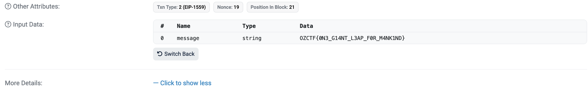

## Solution

This challenge serves as the entrpyoint to the CTF by using a transaction on Sepolia. To solve it, you need to open the Etherscan link, scroll down, click on show more, and then click on decode input data. You will see the flag as the parameter for the `hello` function:

